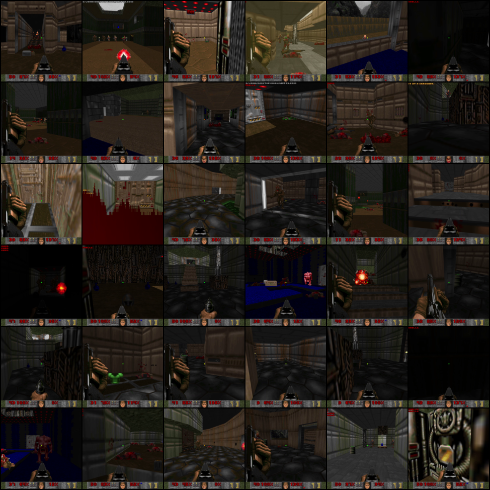
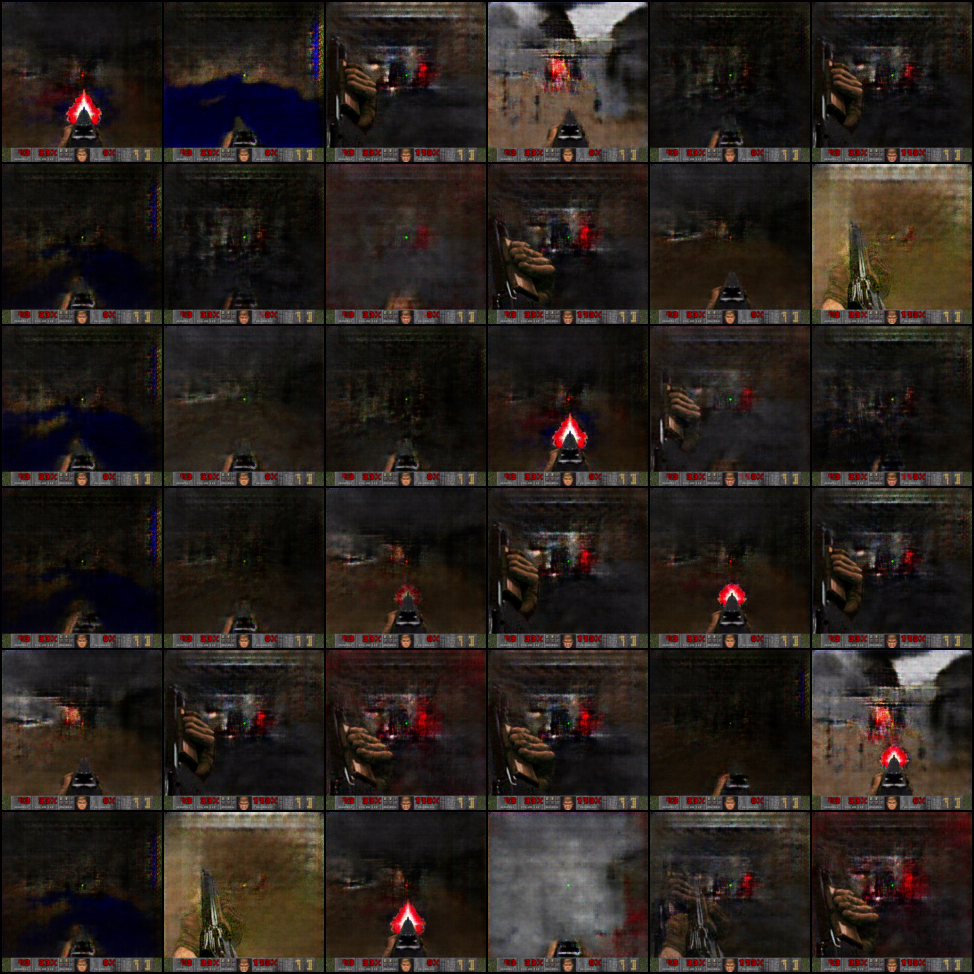
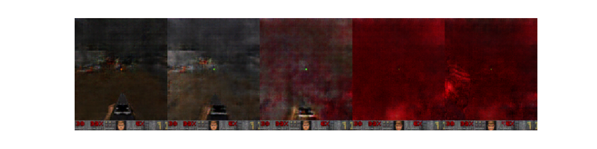

## Project Summary

Wanted to practice more with PyTorch and try out training a GAN because they seem really powerful and interesting.  I didn't want to copy the common examples of MNIST or CelebA, so I played DOOM for about 30 minutes and used that as training data for my GAN.

Unfortunately, GANs are hard to train to begin with, and I think my choice of training data only made things worse; there are a lot of under-represented frames (next level screen, death screen, water areas), and the status bar and shotgun (it's the best weapon!) are extremely over-represented to the point where they're in every generated picture.  The generated pictures never really looked terribly good, and seem to suffer from a bit of mode collapse.

Anyway, I feel like I learned a good bit more about PyTorch and GANs, and that was the goal!

## Example Gameplay Frames

## Example Generated Frames

## Example Interpolation

Was really hoping to see the health value decrease when interpolating to the "taking damage" screen, but no such luck!  It seems certain health/armor values were also over-represented in the frames...

Implemented ideas from the following papers:

Sampling Generative Networks - https://arxiv.org/abs/1609.04468

Unsupervised Representation Learning with Deep Convolutional GANs - https://arxiv.org/pdf/1511.06434.pdf
